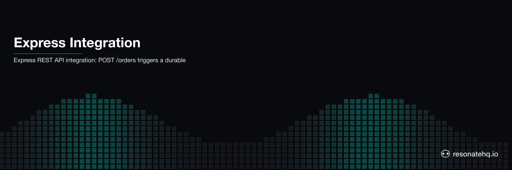

<p align="center">
  <picture>
    <source media="(prefers-color-scheme: dark)" srcset="./assets/banner-dark.png">
    <source media="(prefers-color-scheme: light)" srcset="./assets/banner-light.png">
    
  </picture>
</p>

# Express + Resonate Integration

Durable background workflows from a REST API — powered by Resonate.

A `POST /orders` request starts a 4-step order processing workflow that runs durably in the background. If any step fails, Resonate retries from that step — previous steps do not re-run. If you submit the same order twice (client retry, network blip, double-click), Resonate deduplicates it — the workflow runs exactly once.

No message broker. No separate worker process. No event schema.

```
POST /orders          →  202 Accepted + status URL
                          workflow starts in background
                          validate → reserve → charge → email

GET /orders/:id/status →  { status: "processing" } or { status: "done", result }
```

## The integration pattern

```typescript
// 1. Register your workflow once at startup
const resonate = new Resonate();
resonate.register(processOrder);

// 2. Call resonate.run() from any route handler
app.post("/orders", (req, res) => {
  const order = req.body;

  // order.id is the idempotency key — submit the same order twice → runs once
  resonate.run(`order/${order.id}`, processOrder, order, simulateCrash)
    .catch(console.error);

  res.status(202).json({ status: "accepted", statusUrl: `/orders/${order.id}/status` });
});

// 3. Poll for results
app.get("/orders/:id/status", async (req, res) => {
  const handle = await resonate.get(`order/${req.params.id}`);
  const done = await handle.done();
  if (!done) return res.json({ status: "processing" });
  res.json({ status: "done", result: await handle.result() });
});
```

**Why this shape:** the workflow is a plain generator function. `resonate.run()` is called directly from the route handler with the order ID as the idempotency key. No dedicated route mount, no event schema, no separate discovery protocol — just a function call that happens to be durable.

## How it works

Your workflow is a generator function. Each `yield* ctx.run(step, args)` creates a durable checkpoint:

```typescript
export function* processOrder(ctx, order, simulateCrash) {
  yield* ctx.run(validateOrder, order);        // Step 1 — checkpointed
  yield* ctx.run(reserveInventory, order, simulateCrash);  // Step 2 — retried on failure
  const chargeId = yield* ctx.run(chargePayment, order);  // Step 3 — only after step 2
  yield* ctx.run(sendConfirmation, order, chargeId);       // Step 4 — only after step 3
  return { orderId: order.id, ... };
}
```

**Files:** 3 TypeScript source files, ~130 LOC

## Prerequisites

- Node.js 18+
- `npm install`

## Run it

### Happy path + idempotency demo

```bash
npm start
```

What you'll observe:
- Same order submitted twice
- All 4 steps log exactly **once** (validate, reserve, charge, email)
- Second POST returns immediately from cache — no duplicate processing

### Crash / retry demo

```bash
npm run start:crash
```

What you'll observe:
- Inventory API times out on first attempt
- Resonate retries `reserveInventory` automatically (after 2s)
- `validate` does **not** re-run — its result is checkpointed
- Payment and email only run after inventory succeeds

## What to observe

**Idempotency:** Same order ID → same execution. The second POST finds the existing promise and returns immediately. No duplicate charges, no duplicate emails.

**Crash recovery:** When `reserveInventory` fails, Resonate retries it. The `validateOrder` step that completed before the failure is not re-executed.

**Zero infrastructure:** No Redis, no message broker, no separate worker process. Resonate runs embedded in your Express server.

## Project structure

```
src/
  index.ts      — Express server with Resonate embedded (POST /orders, GET /orders/:id/status)
  workflow.ts   — 4-step order processing workflow (generator function)
  handlers.ts   — Business logic functions (validate, reserve, charge, email)
```

## The integration surface

| | |
|---|---|
| **Mount point** | None — `resonate.run()` is called directly from any route |
| **Trigger** | `resonate.run("order/id", fn, args)` — the first arg is the idempotency key |
| **Function shape** | Plain generator function; no registration decorator, no event schema |
| **Idempotency** | Same promise ID → same execution; deduplicated automatically |
| **Runtime** | Embedded in the Express process, or connected to a Resonate server for multi-process durability |
| **Framework support** | Any Node.js HTTP framework — no per-framework adapter |

[Try Resonate →](https://resonatehq.io) · [Resonate SDK →](https://github.com/resonatehq/resonate-sdk-ts)
